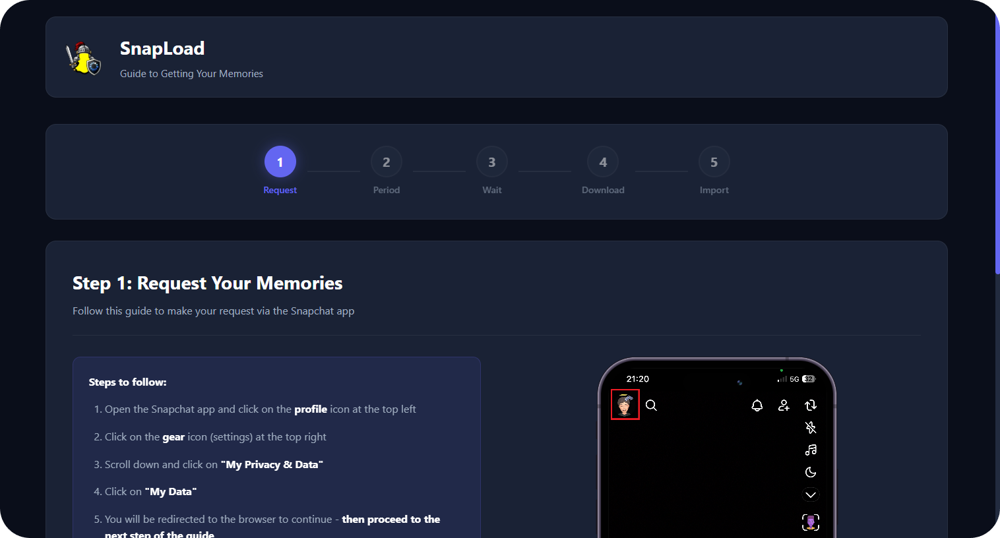
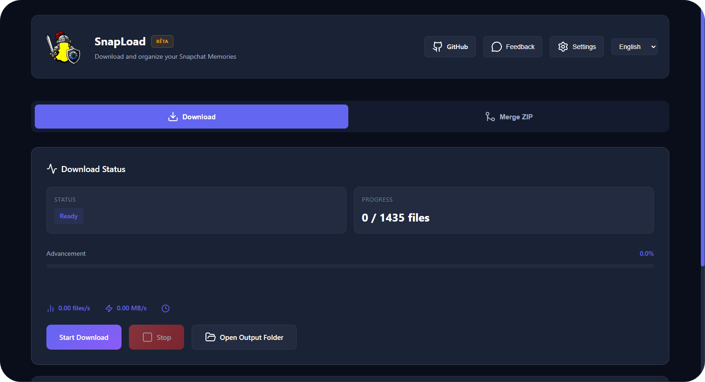
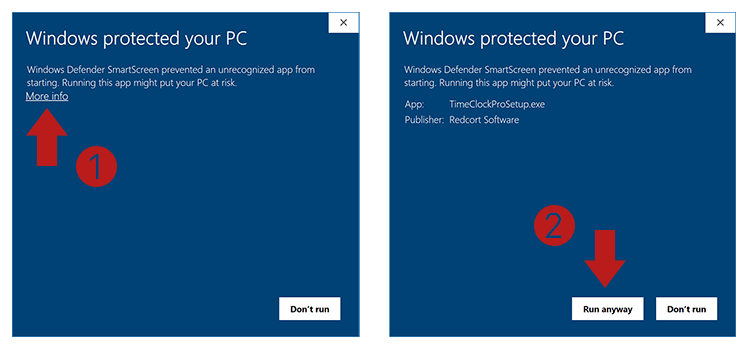

  
  
  
  <h1>✨ SnapLoad — Snapchat Memories Downloader ✨</h1>

  

    
    
    
    
    
    
    
  

  

    SnapLoad is a desktop application designed as a <strong>friendly alternative to Snapchat's official tool for downloading Memories</strong>. 
    The official tool can be unintuitive or fail on large volumes of data. SnapLoad allows anyone to download Memories easily, with <strong>enhanced features</strong>
  

---
## 📑 Table of Contents

- [🚀 Key Features](#-key-features)
- [🖥️ Quick Preview](#️-quick-preview)
- [⚡️ Getting Started](#️-getting-started)
- [🕷️ Known Issues](#️-known-issues)
- [🗺️ Roadmap](#️-roadmap)
- [🙏 Acknowledgments](#-acknowledgments)
- [🤝 Contributing](#-contributing)
- [📄 License](#-license)

---

## 🚀 Key Features

- 📥 **Parallel downloads** with automatic retry mechanism
- ♻️ **Automatic resume** using `download_state.json` (tracks success/failures) and full JSON recovery
- 🧠 **Stable speed & ETA** : dynamic averaging (files/s + MB/s) displayed in real-time
- 🧭 **Enhanced metadata** : localized dates + GPS coordinates written to EXIF/QuickTime tags via ExifTool (photos and videos)
- 🖥️ **Web/Desktop interface** : clean UI with progress bars, statistics, and Start/Stop controls
- 📂 **ZIP handling** : automatically unpacks and organizes Snapchat-provided ZIPs into clean folders
- 👶 **Beginner-friendly guide** : tutorial included for requesting your Snapchat data

---

## 🖥️ Quick Preview

  
  
<i>Memories retrieval guide interface</i>

  
  
<i>Main download interface</i>

---

## ⚡️ Getting Started

### 1️⃣ Installation

Download the setup executable from the [Releases](../../releases) page.

### 2️⃣ Windows SmartScreen Warning

The SnapLoad setup file is not verified by Windows SmartScreen, so you may see a warning about an unknown executable. Don't panic! Simply follow these two steps:

  
  
<i>Click "More info" then "Run anyway"</i>

1. Click on **"More info"**  
2. Click on **"Run anyway"**

### 3️⃣ Enjoy!

That's it! Start backing up your Snapchat memories.

---

## 🕷️ Known Issues

> 👻 **Snapchat-side bug**: Occasionally, requesting data from Snapchat may result in an empty export (issue observed during testing). Despite contacting support, I haven't received a response or solution.

> ⚠️ **Beta status**: The app is currently in beta and may have bugs. Please don't hesitate to report any issues you encounter!

---

## 🗺️ Roadmap

- Linux support
- Faster download

---

## 🙏 Acknowledgments

This project leverages several excellent open-source tools:

- **[ffmpeg](https://ffmpeg.org/)** - Multimedia framework for video/audio processing
- **[ExifTool](https://exiftool.org/)** - Metadata reading and writing
- **[devices.css](https://github.com/picturepan2/devices.css)** - Beautiful device mockups for the UI

---

## 🤝 Contributing

Contributions are welcome! Feel free to:
- 🐛 Report bugs
- 💡 Suggest new features
- 🔧 Submit pull requests

---

## 📄 License

This project is licensed under the MIT License. See the [LICENSE](LICENSE) file for details.

---

  
Built with ❤️ by meyou to simplify backing up your Snapchat memories 👻 

  

    <a href="#-table-of-contents">⬆ Back to top</a>
  

